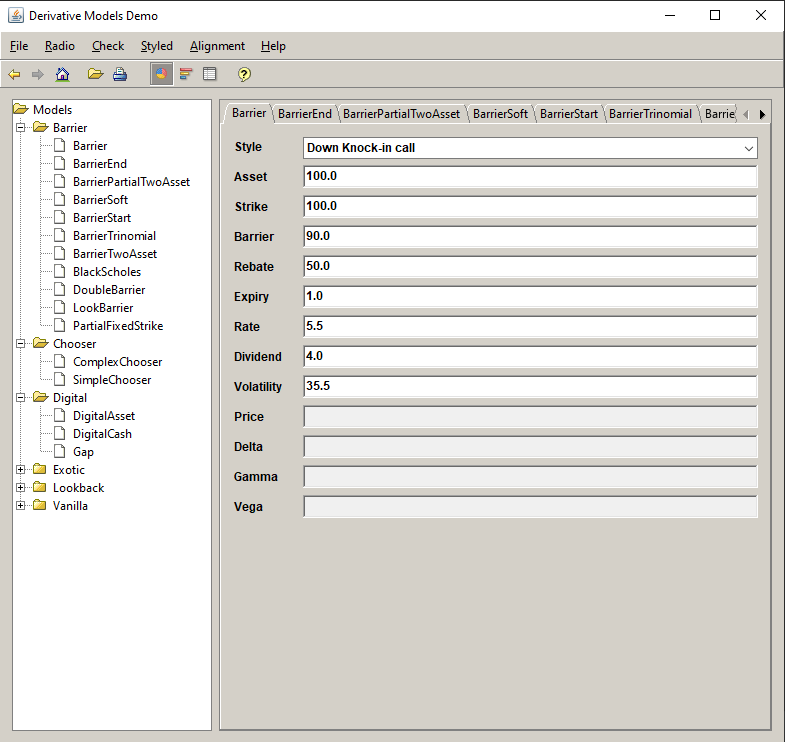

# Option Functions and a calculaor UI in Java

All the function models described in the book **The complete guide to option pricing formulas** by Espen Gaarder Haug were implemented in this project.

It was done a while ago, I lost my original source code but found the jar file. The source code was mainly recovered from the jar.

Part of the code has been rewritten with new features in Java 8, e.g. Lambda expression, etc.

The calculator looks like the following:

